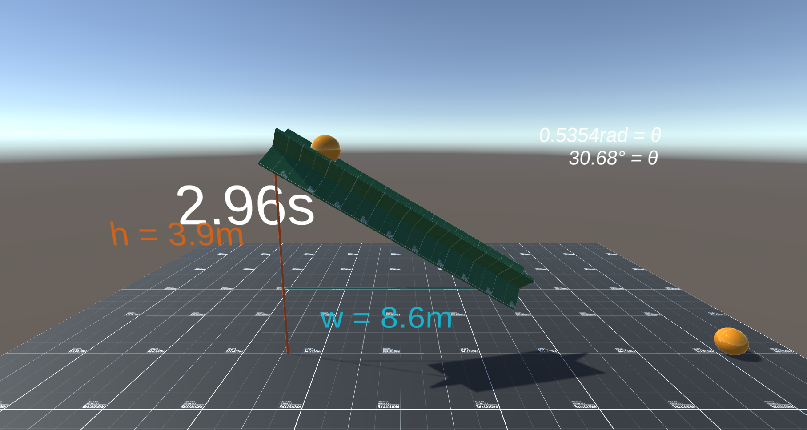

# PH 211 Lab Solver

A lot of the lab assignments in PH 211 seemed to be similar, so I made this Unity project to save myself (and lab partners) some time. The prefabs and scripts are very customizable (if you can get over my monkey code), so you should be able to easily compose these assets into a scene that fits whatever lab assignment you are given. By the time I realized I could do this, there were only two labs left, so I hope this saves you the effort of timing falling cotton balls.

In the scene, you have access to the following parameters
- kinematic friction
- static friction
- gravity
- ramp length and angle
- ball size, mass, friction, and drag

The scenes can be instantiated to run several trials at the same time. An error function must be used to scatter the results, or else all the values would be the same across trials. 
